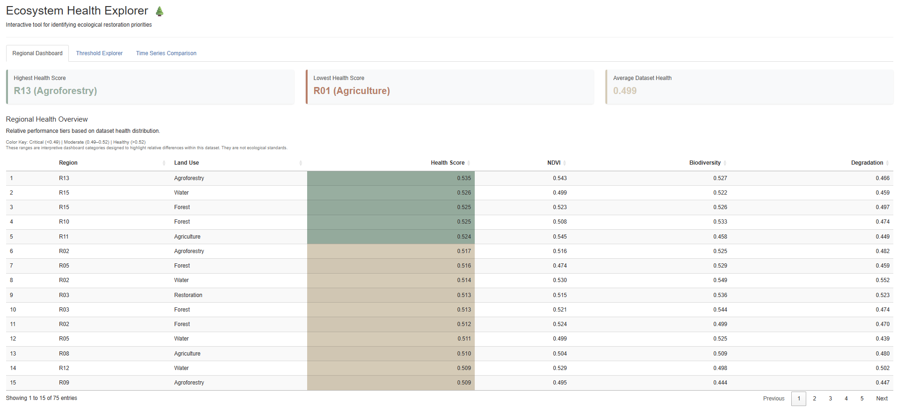
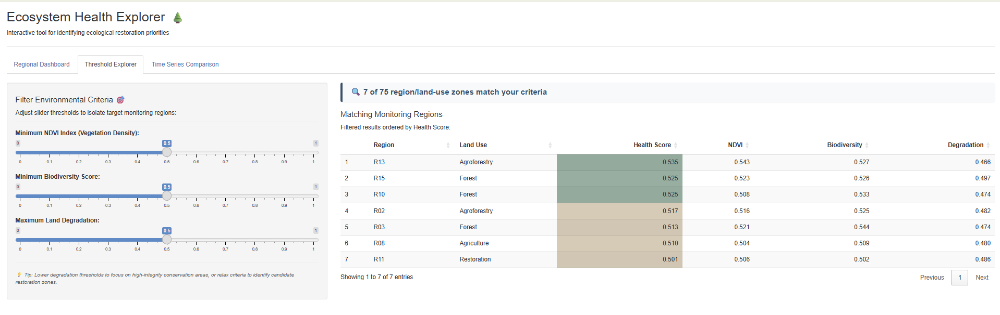
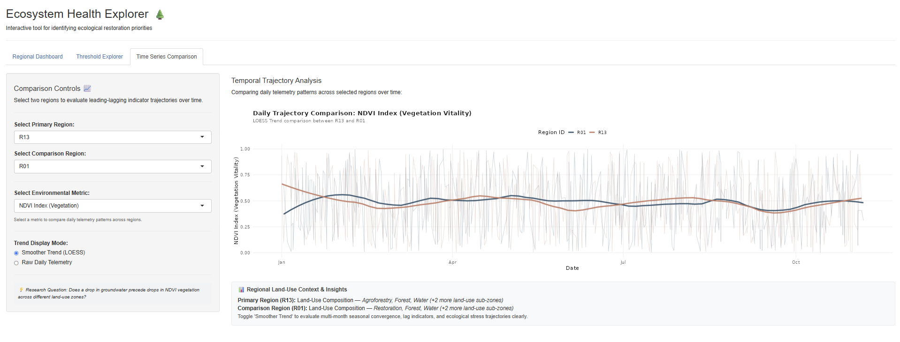

# Ecosystem Health Explorer 🌲

Interactive Shiny app for ecological restoration prioritization.

---

## 📸 Preview

### 1. Regional Health Overview

*Interactive summary metrics and dynamic ranking table for monitored regions.*

### 2. Environmental Threshold Explorer

*Reactive multi-slider filtering isolating priority restoration zones.*

### 3. Temporal Trajectory Analysis

*Side-by-side regional trajectory comparison with LOESS trend smoothing.*

---

## 📊 Project Overview

This project was developed as part of my Data Visualization portfolio. It models an interactive decision-support tool designed to help environmental managers, restoration ecologists, and regional conservation boards monitor ecological conditions and identify potential restoration priorities.

The application transforms continuous environmental telemetry into interactive regional summaries, threshold-based filtering tools, and temporal trend comparisons.

---

## ❓ Research Question

> *How can continuous environmental monitoring data be used to identify high-priority regions for ecological restoration?*

The temporal analysis component also explores:

> *Does a drop in groundwater precede drops in NDVI vegetation across different land-use zones?*

---

## ✨ Features

* **Regional Health Dashboard:** Interactive table ranking regional land-use zones by Composite Health Score, with color-coded health tiers and summary KPIs.
* **Threshold Explorer:** Reactive environmental thresholds for NDVI, biodiversity, and land degradation that allow users to identify regions meeting specific criteria.
* **Temporal Trajectory Analysis:** Interactive comparison of environmental metrics across two selected regions over time.
* **Trend Display Modes:** Compare raw daily telemetry with smoothed LOESS trends to make longer-term environmental patterns easier to interpret.
* **Environmental Metric Selection:** Explore trajectories for NDVI, groundwater level, soil moisture, and land degradation.
* **Land-Use Context:** View the land-use composition associated with selected monitoring regions to support interpretation of environmental trends.

---

## 🛠 Tech Stack

* **Language:** R
* **Framework:** Shiny
* **Data Wrangling & Visualization:** tidyverse (`dplyr`, `ggplot2`), `lubridate`
* **Interactive Tables:** DT
* **Version Control & Hosting:** Git/GitHub, shinyapps.io

---

## 📂 Dataset

This project uses a synthesized environmental telemetry dataset containing **7,456 observations** collected across **15 monitoring regions(comprising 75 region/land-use sub-zones)**.

Key variables include:

- Groundwater Level
- Soil Moisture
- Soil Temperature
- Soil pH
- Rainfall
- NDVI Index
- Vegetation Density
- Biodiversity Index
- Land Degradation Index
- Land Use Category
- Timestamp

---

## 🔬 Methodology

1. Loaded and cleaned hourly environmental monitoring data.
2. Parsed timestamps and aggregated telemetry into daily regional summaries.
3. Calculated a Composite Ecological Health Score using NDVI, biodiversity, and land degradation indicators.
4. Created regional summary statistics for health, vegetation, biodiversity, and degradation.
5. Developed reactive environmental threshold filters to identify potential restoration priorities.
6. Built interactive temporal visualizations comparing environmental trajectories between selected regions.
7. Added LOESS smoothing to help identify longer-term patterns within noisy daily telemetry.

---

## 🌐 Live Demo

[Explore the live application on shinyapps.io](https://ashleystone.shinyapps.io/eco-restoration-explorer/)

---

## 💡 Key Insights

* **Tight Ecological Health Distribution:** Composite Health Scores across all 75 monitored region/land-use zones cluster tightly around a dataset average of 0.499 (ranging from a low of 0.466 in R01 Agriculture to a high of 0.535 in R13 Agroforestry).
* **Strict Threshold Bottlenecks:** Because baseline metrics cluster near 0.500, applying minimum NDVI or Biodiversity filters of 0.500 excludes 80% of monitored zones (dropping matching regions from 75 down to 15).
* **Universal Baseline Degradation:** Attempting to filter for zero land degradation yields 0 matching regions, confirming that degradation is present across every single monitored zone and highlighting the necessity of prioritized restoration over simple preservation.
* **Land-Use Score Variance:** Agricultural zones appear in both high-performing and critical health tiers, demonstrating that localized telemetry and management practices drive ecological outcomes more than broad land-use categorization alone.
* **High Telemetry Noise & Seasonal Convergence:** Raw daily NDVI telemetry exhibits extreme daily volatility (0.00 to 1.00), making LOESS trend smoothing critical. Time-series analysis reveals that even the highest (R13) and lowest (R01) performing regions converge toward the ~0.50 baseline by spring and experience synchronized seasonal dips in July and September.

---

## 🎯 Learning Objectives

This project was designed to demonstrate:

* Interactive Shiny application development
* Reactive programming and dynamic filtering
* Time-series visualization and trend analysis
* Environmental data preparation and pipeline design
* Git/GitHub version control
* UX/UI design for decision-support tools

---

## 📁 Project Structure

```text
eco-restoration-explorer/
├── data/                       # Source telemetry CSV and processed RDS datasets
├── .gitignore                  # Version control ignore list
├── 01_data_prep.R              # Data processing and aggregation pipeline
├── README.md                   # Project documentation
├── app.R                       # Main R Shiny application file
└── eco-restoration-explorer.Rproj # RStudio project file
```
---